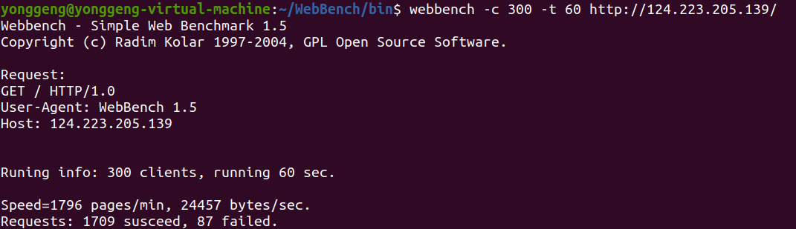
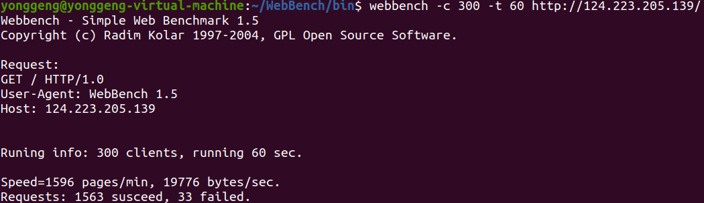
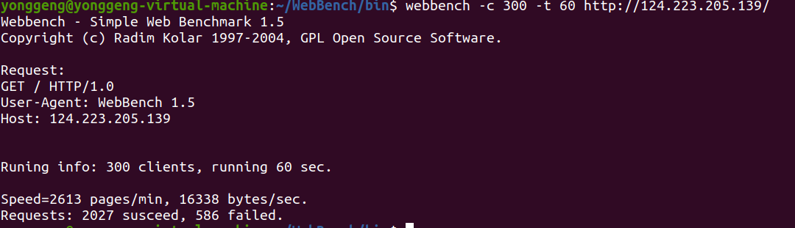

## 简介
这是一个轻量级的Web服务器，目前支持GET、HEAD方法处理静态资源。并发模型选择: 单进程＋Reactor+非阻塞方式运行。
测试页面：http://124.223.205.139/

## 核心功能及技术
* 目前支持 HTTP GET、HEAD方法
* 使用 epoll + 非阻塞IO + 边缘触发(ET) + 线程池 + 定时器 实现高并发处理请求 
* 使用 EPOLLONESHOT保证一个socket连接在任意时刻都只被一个线程处理 使用定时器支持HTTP长连接，通过定时器处理超时连接，异常连接 
* 使用function类和bind实现定时器回调函数接口化，从而提高定时器代码复用。
* 使用 priority queue 实现的最小堆结构管理定时器，使用定期删除，提高性能 
* 使用根据HTTP请求报文格式，模拟状态机解析HTTP请求报文。
* 使用RAII手法封装互斥器(pthrea_mutex_t)、 条件变量(pthread_cond_t)等线程同步互斥机制 
* 使用RAII管理文件描述符等 资源使用shared_ptr、weak_ptr管理指针，防止内存泄漏
## WebBench进行压测
**服务器端使用腾讯云**
* CPU：2核 
* 内存：2G
* 硬盘：40G
* 系统：ubuntu

**客户端WebBench使用本地虚拟机**
* CPU: 4核
* 内存：4.5G
* 硬盘：60G
* 系统：ubuntu
#### 测试不同工作线程个数对测试结果的影响
* 服务器使用6个工作线程，webbench 300clients 60 sec结果如下
* 
* 服务器使用5个工作线程，webbench 300clients 60 sec结果如下
* 
* 服务器使用4个工作线程，webbench 300clients 60 sec结果如下
* 
* 服务器使用3个工作线程，webbench 300clients 60 sec结果如下
* 
* 服务器使用2个工作线程，webbench 300clients 60 sec结果如下
* 
* 服务器使用1个工作线程，webbench 300clients 60 sec结果如下
* 

**分析与总结**
* speed: 每秒钟响应请求数目，
* susceed: 返回成功个数
* failed： 返回失败个数
* 这边可以看到使用3个工作线程http请求速度时最快的，成功的连接也是最多的。因为我使用的服务器是2核2G的，所以每次最多2个工作线程同时工作，第3个线程可以在其中某个线程阻塞时运行，尽可能保证cpu满负荷。但是过多的工作线程会导致线程切换过于频繁，线程切换虽然很快，但是也会耗时，尤其是本项目，用简单的get方法的IO数据量并不大，所以多开更多的线程并不能更快
**如何分配最佳的线程数目**
* 最佳线程数目 = （（线程等待时间+线程CPU时间）/线程CPU时间 ）* CPU数目。这里的线程等待时间可以看成线程等待IO时间
* CPU密集型可以设置为 核心数 + 1
* 具体有多种业务线程的线程池可以用压力测试看具体多少合适

#### 自己实现的和github原项目测试结果的对比
* 原项目服务器使用3个工作线程，webbench 300clients 60 sec结果如下


* 我的项目服务器使用3个工作线程，webbench 300clients 60 sec结果如下


**总结与分析**
* 感觉自己speed和原项目相比少了快1/5，但是原项目failed多了14倍数。目前主要是定时器设计部分和原项目不太一样，内存池功能目前还没用进去。感觉主要是speed的原因,speed上去success也能上去。

### 定时器设计逻辑Timer.h Timer.cpp
#### 什么是定时器
* 心跳机制，客户端定期向服务端发送心跳信息
* TCP可靠性传输，一段时间内没有收到响应时重新发送数据包
* 每天10点为客户生成对账单
* 每年双11的0点开启秒杀
* 各类MQ的延时消息
* js中的setInterval
* 所以定时器本质就是当到达指定时间去处理一些事件

#### 一个定时器类应该包含哪些部分
* 从需求从出发，当定时器超时我们要处理这个定时器相关的数据和事件，因此这里至少需要一个变量表示超时时间，和判断是否超时和处理超时事件的函数 和 函数参数
* 如何实现一个对不同事件可重用的定时器？对于不同事件的定时器的差别在于事件的回调函数和参数列表是不同的，所以给一个定时器类传递不同的回调函数和参数列表是个问题。我们这边可以使用函数指针，来接收回调函数。对于参数列表，考虑处理的事件的数据本身就是个类，所以我们统一要求传递回调函数的参数只有一个shared_ptr<void * >的参数表示就行，回调函数内部再用static_pointer_cast强转即可，可以用一个struct 保存这一一个函数指针和参数，函数指针用function类表示。具体代码如下


```
/*定义*/
struct Task{/*封装回调函数*/
    std::function<void(std::shared_ptr<void>)> function;/* 函数 */
    std::shared_ptr<void> arg;/*参数*/
};

/*使用*/
Task task;
task.function = std::bind(&WebServer::do_request, this, std::placeholders::_1);
task.arg = it;
```
* 在什么时机调用回调函数？我们可以把需要监管的超时事件放到定时器管理器中，当超时后我们就要执行里面的回调函数，之后的定时器就没用了，所以就删除这个定时器，利用RALL思想，同理在定时器的析构函数中调用回调函数，这样就可以保证定时事件的处理

* 对于本项目要考虑定时器处理的任务可能会提前被处理（当然只是这个项目处理方案的原因），如果任务线程发现连接异常，会提前关闭fd,所以定时器处理任务时要判断，是否已经提前处理。

* 项目中httpData类需要与对应定时器关联,因为定时器CbTask中已经用了shared_ptr为了防止循环引用，所以httpData类中使用weak_ptr

#### 定时器相关问题
* 1. 如果使用的定时器很多的话，每次轮询判断哪些定时器超时的时间也会比较长
* 2. 如果线程轮询的频率高了(如：1ms一次)，就会导致CPU占用过高，如果轮询频率低了，又会导致任务处理不及时
* 3. 如果一个任务执行的时间比较长，那在它后面的任务会被延迟执行

#### 对于上面的问题我们引入定时器管理类
**1.**
* 我们如何判断哪些是到期需要处理的任务？遍历O(N)不可取，所以我们可以对定时器排序，把可能超时的定时器排在前面即可，但是排序nlogn，还是很慢，所以可以使用优先队列（最小堆），也可以使用时间轮。每次查看堆顶定时器是否超时即可，插入删除是logn的。不过容器维护的常数比较大，如果定时器数量不大，可以用链表代替。

* 如果有多个线程操作容器中的定时器？使用互斥锁保证多线程对定时器的互斥操作（注意上锁是给数据上锁）。对于本项目，在主线程中增加和删除定时器，但是其他工作线程处理http请求的时候发现连接异常或者报文错误，会把连接关闭释放资源，对应要断开与容器中定时器的连接，所以会有操作同个定时器的可能。 当然上锁需要同步访问数据会导致性能问题。

**2.**
* 可以把轮询时间（判断是否有定时任务到期）定为堆顶定时器超时时间，这样每次判断都时有效的

**3.**
* 可以使用多线程执行定时任务。当然本项目的定时任务耗时都很低。
